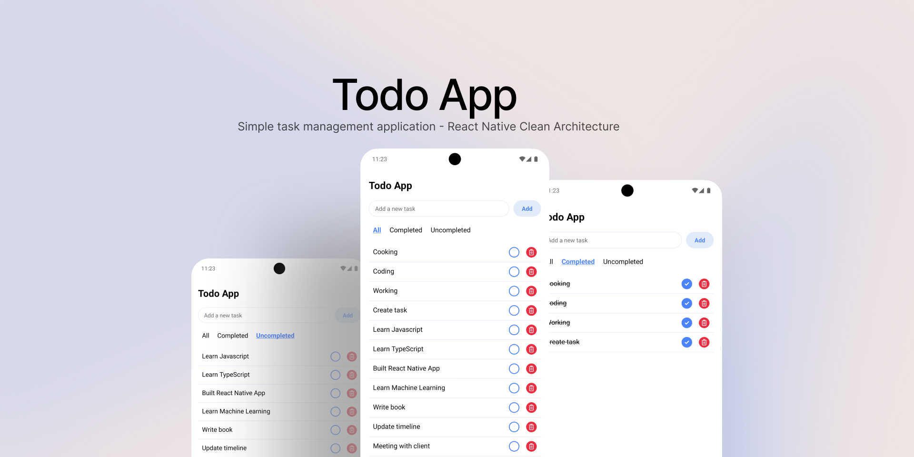

# Todo App 
[](https://codecov.io/gh/M-Julius/Todo-App)

[](screenshot/TodoApp.jpg)
Todo App is a simple task management application built using Expo React Native with a clean architecture implementation.

## Features

- Add, delete, and mark tasks as complete.
- Filter tasks by status: all, completed, uncompleted.
- Local storage using AsyncStorage.
- Clean architecture implementation to separate domain, data, and presentation layers.

## Requirements

- Node.js (v16 or later)
- Expo CLI (v6.3.14 or later)
- Git

## Installation

### 1. Clone the repository

```
git clone https://github.com/M-Julius/Todo-App.git
```

### 2. Navigate to the project directory

```
cd Todo-App
```

### 3. Install dependencies

```
yarn install
```

### 4. Run the project

Once all dependencies are installed, you can run the application using the command:

```
npx expo start
```

The app will run in your browser. You can choose to run it on an Android or iOS emulator, or on a physical device using the **Expo Go** app.

### 5. Running tests

To run the unit tests, use the command:

```
yarn test
```

## Project Structure

This project follows a clean architecture approach, separating code into layers to ensure scalability and maintainability.

<pre>struktur
├── assets/                     # Assets like images
├── src/
│   ├── data/
│   │   └── repositories/        # Data access from AsyncStorage
│   ├── domain/
│   │   ├── entities/            # Todo model
│   │   └── usecases/            # Business logic for Todo
│   ├── presentation/
│   │   ├── components/          # UI components (TodoItem, etc.)
│   │   ├── screens/             # UI screens (TodoScreen)
│   │   └── themes/              # Themes (colors, etc.)
└── App.tsx                      # Application entry point
</pre>

### Structure Explanation

- **assets/**: Contains resources like icons and images.
- **data/**: Contains repository implementations for saving and retrieving data from AsyncStorage.
- **domain/**: Contains business entities (models) and use cases that define the application logic.
- **presentation/**: Contains UI components and screens that display data and interact with the user.
- **App.tsx**: The main file that starts the application and sets up navigation.

## Clean Architecture

This application follows **clean architecture**, which separates business logic (domain) from data storage (data) and presentation (UI). This makes the code easier to maintain, test, and modify without affecting other parts of the application.

## Technologies Used

- [Expo](https://expo.dev/)
- [React Native](https://reactnative.dev/)
- [TypeScript](https://www.typescriptlang.org/)
- [AsyncStorage](https://react-native-async-storage.github.io/async-storage/)
- [Jest](https://jestjs.io/) for testing
